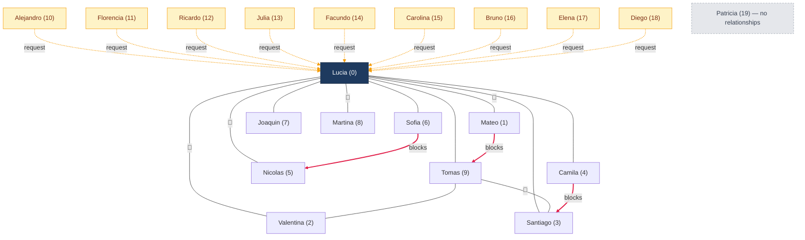

# KinMeet — Manual QA Testing Guide

A thorough, click-by-click guide for classic manual QA of the KinMeet web app. It assumes a **fresh database** seeded from `back-end/src/scripts/seedUsers.ts`.

Each flow lists **Preconditions → Steps → Expected results → Edge cases**. Check off items as you go. Where behavior is a **known limitation** (not a bug), it is flagged so you don't file false positives — but you can still log them as UX findings.

---

## Table of Contents

1. [Environment setup (fresh start)](#1-environment-setup-fresh-start)
2. [Seed data reference & test-account cheat sheet](#2-seed-data-reference--test-account-cheat-sheet)
3. [Authentication](#3-authentication)
4. [Profile (view / edit / photo)](#4-profile-view--edit--photo)
5. [Discovery / Matching](#5-discovery--matching)
6. [Connection requests](#6-connection-requests)
7. [Connections (Kins)](#7-connections-kins)
8. [Chat / Messaging (real-time)](#8-chat--messaging-real-time)
9. [Blocking & reporting](#9-blocking--reporting)
10. [Settings & account management](#10-settings--account-management)
11. [Cross-cutting: navigation, responsive, a11y, states](#11-cross-cutting-navigation-responsive-a11y-states)
12. [Known limitations (expected behavior — do not file as bugs)](#12-known-limitations-expected-behavior)
13. [Quick regression checklist](#13-quick-regression-checklist)

---

## 1. Environment setup (fresh start)

### 1.1 Prerequisites
- Node 22 (`nvm use`), MongoDB running on `localhost:27017`.
- Back-end `.env` present (see `README.md`). For **password-reset email testing**, set:
  - `NODE_ENV=development`
  - `ENABLE_DEVELOPMENT_EMAIL=true` + a valid `RESEND_API_KEY` to send real email, **or**
  - leave `ENABLE_DEVELOPMENT_EMAIL` unset to have the reset email **logged to the back-end console** instead of sent (recommended for QA — you'll read the reset link from the terminal).

### 1.2 Seed a clean database
From `back-end/`:

```bash
npm run seed:reset      # drops the kinmeet DB, then seeds 20 users + graph
```

Expected console summary (order matters): users created → connections → pending incoming requests → messages → blocks → `Done! Created 20 users, skipped 0`. All users share password **`Password123`**.

> `npm run seed` (without `:reset`) is idempotent — it skips existing users. Use `seed:reset` whenever you want to return to the documented baseline state below.

### 1.3 Run the app (two terminals)

```bash
cd back-end  && npm run dev     # http://localhost:8080
cd front-end && npm run dev     # http://localhost:5173
```

Open `http://localhost:5173`.

### 1.4 Multi-user testing tip
Real-time chat, connection requests, and blocking need **two logged-in users at once**. Use **two different browsers** or a **normal + incognito window** (tokens live in `localStorage`, so two tabs in the same profile share one session).

---

## 2. Seed data reference & test-account cheat sheet

**Every account password: `Password123`.** All 20 users are **Argentina → Canada**, so they are all eligible to match each other. Every seed user has its own `dateOfBirth` and `gender` so profile **age** and **gender** render (age spread ≈ 24–66; user 18 Diego has gender `other`, everyone else is `female`/`male`).

### 2.1 Users

| Idx | Name | Email | Notable seed state |
|----|------|-------|--------------------|
| 0 | Lucia Martinez | lucia.martinez@example.com | **Hub** — 9 kins, 9 pending incoming requests, 4 chat threads |
| 1 | Mateo Gomez | mateo.gomez@example.com | Kin of Lucia; chat w/ Lucia; **blocked Tomas** |
| 2 | Valentina Lopez | valentina.lopez@example.com | Kin of Lucia & Tomas; chat w/ Lucia |
| 3 | Santiago Fernandez | santiago.fernandez@example.com | Kin of Lucia & Tomas; chat w/ Tomas; **blocked by Camila** |
| 4 | Camila Ruiz | camila.ruiz@example.com | Kin of Lucia only; **blocked Santiago** |
| 5 | Nicolas Silva | nicolas.silva@example.com | Kin of Lucia; chat w/ Lucia; **blocked by Sofia** |
| 6 | Sofia Moreno | sofia.moreno@example.com | Kin of Lucia; **blocked Nicolas** |
| 7 | Joaquin Garcia | joaquin.garcia@example.com | Kin of Lucia only |
| 8 | Martina Aguirre | martina.aguirre@example.com | Kin of Lucia; chat w/ Lucia |
| 9 | Tomas Perez | tomas.perez@example.com | Kins: Lucia, Valentina, Santiago (Mateo removed by block); chat w/ Santiago |
| 10 | Alejandro Vega | alejandro.vega@example.com | **1 pending request sent to Lucia** |
| 11 | Florencia Diaz | florencia.diaz@example.com | pending request → Lucia |
| 12 | Ricardo Soto | ricardo.soto@example.com | pending request → Lucia |
| 13 | Julia Romero | julia.romero@example.com | pending request → Lucia |
| 14 | Facundo Castro | facundo.castro@example.com | pending request → Lucia |
| 15 | Carolina Navarro | carolina.navarro@example.com | pending request → Lucia |
| 16 | Bruno Acosta | bruno.acosta@example.com | pending request → Lucia |
| 17 | Elena Vargas | elena.vargas@example.com | pending request → Lucia |
| 18 | Diego Morales | diego.morales@example.com | pending request → Lucia; **gender = other** |
| 19 | Patricia Flores | patricia.flores@example.com | **No kins, no requests, no messages** (clean/empty account) |

### 2.2 Which account to use for what

| Goal | Use | Why |
|------|-----|-----|
| Requests inbox (accept/ignore) | **Lucia** | 9 pending incoming requests |
| Connections list & remove kin | **Lucia** | 9 kins |
| Existing chats + unread badge | **Lucia** | 4 threads; **2 unread** (from Mateo & Valentina) |
| Empty states everywhere | **Patricia** | No kins/requests/messages |
| "No More Matches" empty state | **Lucia** | Only 1 candidate left (Patricia); Meet/Pass her → empty |
| Two-way chat / real-time | **Lucia** + **Mateo** | Connected + existing thread |
| Blocked-side behavior | **Tomas** (blocked by Mateo) | Connection to Mateo was removed |
| Sender of a pending request | any of **Alejandro…Diego (10–18)** | Each has 1 pending request to Lucia |

### 2.3 Baseline connection graph (after blocks)
- **Lucia (0)** ↔ 1,2,3,4,5,6,7,8,9 (9 kins).
- **Tomas (9)** ↔ 0,2,3 (Mateo link removed by block).
- Everyone 4–8 is connected **only** to Lucia.
- Blocks: Mateo→Tomas, Sofia→Nicolas, Camila→Santiago.
- Seed chat threads: Lucia↔Mateo, Lucia↔Valentina, Lucia↔Nicolas, Lucia↔Martina, Santiago↔Tomas.

### 2.4 Relationship map (Mermaid)

Complete seed relationship graph after the block step runs. Edge legend:

- **Solid line** = active connection (kin)
- **💬 label** = connection that also has a seed chat thread
- **Amber dashed arrow** = pending connection request (sender → receiver)
- **Red thick arrow** = block (blocker → blocked; the connection between them, if any, was removed)
- **Lucia (0)** is the hub; **Patricia (19)** is fully isolated; **10–18** are request senders.



> **Reading the blocks:** Mateo→Tomas removed their connection (Tomas ends with 3 kins: Lucia, Valentina, Santiago). Sofia→Nicolas and Camila→Santiago had no prior connection, so only a block record exists — but each pair is still excluded from the other's Discover.

---

## 3. Authentication

### 3.1 Registration — happy path (4-step signup)
**Precondition:** Logged out. Go to `/signup`.

**Steps & expected:**
- [ ] **Step 1 – Create Account:** enter a new email, leave username blank, password `Password123`, confirm `Password123` → **Next** advances (email availability is checked against the API before advancing).
- [ ] **Step 2 – Profile Info:** first name, last name, pick **Home country = Argentina**, city (typeahead ≥2 chars) or manual province/country, **Current country = Canada**, DOB, gender → **Next**.
- [ ] **Step 3 – Work & Education:** all optional → **Next** works even if empty.
- [ ] **Step 4 – Languages & Interests:** add ≥1 language, choose ≥1 "Looking For" → **Create account / Finish**.
- [ ] Redirected to **/discover**. New user is **immediately logged in** (no email verification step).
- [ ] Because home/current = Argentina/Canada, the new user sees seed users as match candidates.

> **Tip:** To later log in as this user, note the auto-generated username is `{firstname}{4 digits}` when you leave username blank.

### 3.2 Registration — field validation & edge cases
- [ ] **Existing email** (e.g. `lucia.martinez@example.com`) → Step 1 blocks with "email taken / not available" message.
- [ ] **Password too short** (`Pass1`) → client blocks (< 8 chars).
- [ ] **Password mismatch** (confirm differs) → client blocks.
- [ ] **Weak-but-8-char password** on client (e.g. `password` all lowercase): client **only checks length** so it may pass Step 1 — but the **server** enforces upper+lower+digit and should reject on final submit. Verify the error surfaces. *(Known client/server mismatch — see §12.)*
- [ ] **Username format:** enter `AB` → too short (min 3); enter `Bad-Name!` → invalid (only `a-z 0-9 _`); enter `Valid_Name` → accepted, lowercased.
- [ ] **DOB boundaries:** date input min = today−120y, max = today. Future date and >120y should be blocked.
- [ ] **No minimum age:** a DOB making the user < 18 is **accepted** (no 18+ gate). *(Known gap — see §12.)*
- [ ] **Required-field guards:** try to advance each step with a required field empty (first name, last name, home country, city/province, DOB, gender, ≥1 language, ≥1 looking-for) → advance is blocked with inline messaging.
- [ ] **About > 500 chars** → blocked / trimmed at 500.
- [ ] **Photo upload in Step 2:** upload a valid JPEG/PNG/WebP/GIF ≤5 MB → preview shows. Upload a **>5 MB** file or a **non-image** (e.g. `.pdf`) → rejected with "under 5 MB" / "Only JPEG, PNG, WebP, and GIF".
- [ ] **Progress dots:** you can click back to a **previously reached** step but not skip ahead to unreached steps.
- [ ] **Photo upload failure is non-blocking:** if the photo API call fails, account is still created and you still land on `/discover`.

### 3.3 Login
- [ ] Valid credentials (`lucia.martinez@example.com` / `Password123`) → `/discover`.
- [ ] Wrong password → coral error banner "Invalid credentials".
- [ ] Non-existent email → same generic "Invalid credentials" (no distinction between wrong email vs wrong password).
- [ ] Empty email / password → HTML5 required validation.
- [ ] Email case-insensitivity: `LUCIA.MARTINEZ@EXAMPLE.COM` logs in (email is normalized/lowercased).
- [ ] "Forgot password?" link navigates to `/forgot-password`.

### 3.4 Forgot / reset password
**Precondition:** Logged out; back-end console visible (dev email logging) or real inbox configured.
- [ ] `/forgot-password` → submit **known** email → success message replaces form ("check your email"), "Back to Sign In" shown.
- [ ] Submit **unknown** email → **404 "No account found with this email."** *(Reveals whether email is registered — known privacy gap, §12.)*
- [ ] Grab the reset link: from Resend inbox, or from the back-end console log (`{WEB_APP_URL}/reset-password?token=...`).
- [ ] Open reset link → set new password `NewPass123` (must satisfy 8+/upper/lower/digit) + confirm → success → redirected to `/login` with **green flash** "Password reset successful…".
- [ ] Log in with the **new** password → succeeds; old password → fails.
- [ ] **Edge:** open `/reset-password` with **no token** → "Invalid Link" + link to request a new one.
- [ ] **Edge:** reuse a **used** token, or wait > **1 hour** for expiry → reset fails with an appropriate error (link to request a new one may appear).
- [ ] **Edge:** reset-password with mismatched confirm → client blocks; weak password → client regex blocks.

### 3.5 Logout & session
- [ ] User menu (top-right avatar) → **Sign Out** → redirected to `/login`; local session cleared.
- [ ] After logout, navigating to `/discover` (or any protected URL) → redirected to `/login`.
- [ ] **Session persistence:** log in, refresh the page → still logged in (token in `localStorage`). Brief full-screen "Loading…" spinner during auth hydration is expected.
- [ ] **Known:** the JWT is **not** server-invalidated on logout (valid ~7 days) — not observable in normal UI use.

---

## 4. Profile (view / edit / photo)

### 4.1 View own profile
**Precondition:** logged in as Lucia. Go to user menu → **My Profile** (`/profile`).
- [ ] Shows photo/initials avatar, **full name**, @username, **gender**, **age** (computed from DOB — verify it's a plausible number, not blank), about, industry/education (if set), home country (with flag), current location (province + country), languages, interests, looking-for.
- [ ] **"Edit Profile"** button is visible on own profile.

### 4.2 View another member's profile
**Precondition:** logged in as Lucia.
- [ ] Open a **connected** member (e.g. from Kins → open Mateo, or `/profile/<Mateo id>`) → **full last name shown**; no Edit/Delete controls.
- [ ] Open a **non-connected** member (e.g. via a Discover card's flow, or Patricia's id) → **last name hidden** (privacy rule); Discover cards show **first name only**.
- [ ] Age & gender render for other members too.

### 4.3 Edit profile
**Precondition:** `/profile` → **Edit Profile**.
- [ ] Change **About**, save → persists after reload.
- [ ] Required-field guards: clear first name / last name / gender / DOB / home country / current country / province → save blocked.
- [ ] **≥1 language** and **≥1 looking-for** enforced on save.
- [ ] **Graduation year**: value outside 1950–2100 rejected; within range accepted.
- [ ] **About > 500 chars** rejected.
- [ ] Email / username / password are **not** editable here (that's in Settings) — confirm they're absent from the edit form.

### 4.4 Profile photo
- [ ] In edit form, **add** a photo (valid image ≤5 MB) → Save → avatar updates on profile and in the top nav.
- [ ] **Replace** photo → old one is swapped.
- [ ] **Remove** photo → avatar falls back to initials/placeholder.
- [ ] **>5 MB** or non-image → rejected with the validation message.

---

## 5. Discovery / Matching

**Matching rule reminder:** candidates must share **both** home country and current country, be `profileComplete`, and exclude yourself, existing kins, anyone with **any** request between you (any status), and blocked users (either direction). Cap 50.

### 5.1 Card stack — happy path
**Precondition:** logged in as **Patricia** (clean account, many candidates). Go to `/discover`.
- [ ] A single profile **card** shows with a remaining-count indicator.
- [ ] Card shows photo/first name only, industry, about, education, home + current location, languages, interests, looking-for. **No last name.**
- [ ] **Pass** → advances to next card (nothing is persisted server-side — passing is a no-op).
- [ ] **Meet** → sends a connection request and advances to next card.
- [ ] Passed users **reappear** on reload/refresh (Pass isn't remembered). *(Known — §12.)*

### 5.2 "No More Matches" empty state
**Precondition:** logged in as **Lucia** (she is connected to 1–9 and has requests from 10–18, leaving only Patricia).
- [ ] `/discover` shows **exactly one** candidate (Patricia).
- [ ] **Meet** or **Pass** her → **"No More Matches"** empty state with a **Refresh** button appears.
- [ ] Click **Refresh** → still empty (no eligible candidates remain).

### 5.3 Matching filter edge cases
- [ ] Register a brand-new user with **Home country ≠ Argentina** (or **Current country ≠ Canada**) → `/discover` shows **"No More Matches"** immediately (no one shares both countries).
- [ ] After you **Meet** someone, they no longer appear as a candidate (request now exists).
- [ ] A user you've **blocked** or been **blocked by** never appears (verify with API-created blocks, §9).

---

## 6. Connection requests

**Lifecycle:** Meet → `pending` → receiver **Accept** (`accepted`, creates connection) or **Ignore** (`ignored`, row kept). There is **no sender "cancel"** and **no outgoing-requests UI**.

### 6.1 Incoming requests — accept
**Precondition:** logged in as **Lucia**; go to `/connections?tab=requests` (or **Kins** nav → **Requests** tab).
- [ ] **Requests** tab shows **9** incoming cards (senders Alejandro…Diego). Each shows sender photo, first name, location, languages, looking-for, **Accept** / **Ignore**.
- [ ] **Kins** nav badge and **Requests** tab badge show the pending count (9), capped display `99+` above 99.
- [ ] **Accept** one (e.g. Alejandro) → card disappears; count drops to 8.
- [ ] Switch to **My kins** tab → Alejandro now appears as a kin; his **full last name** is now visible.
- [ ] Open Alejandro's profile → last name visible; **Message** action available.

### 6.2 Incoming requests — ignore
- [ ] **Ignore** another request (e.g. Bruno) → card disappears; count drops.
- [ ] Bruno does **not** become a kin.
- [ ] **Edge (re-request blocked):** log in as **Bruno**, go to `/discover`. Lucia should **not** reappear as a candidate, and there is no way to re-send — the ignored request row still exists, so a new Meet would be rejected server-side. *(Known — ignore is effectively permanent until the row is cleared by a connection removal or block, §12.)*

### 6.3 Empty state
- [ ] Log in as **Patricia** → Requests tab shows **"No Pending Requests"** empty state; no badge.

### 6.4 Real-time badge (two users)
- [ ] Browser A: **Patricia** on `/connections?tab=requests` (empty). Browser B: **Lucia** — wait, Lucia has no way to request Patricia (already the only match). Instead: Browser B = **any user who still lists Patricia as a match**, e.g. a freshly registered Argentina/Canada user → **Meet** Patricia.
- [ ] Verify Patricia's pending badge / Requests list updates (on refresh at minimum; confirm whether it updates live).

---

## 7. Connections (Kins)

**Precondition:** logged in as **Lucia**; go to `/connections` (default **My kins** tab).

- [ ] List shows **9 kins** with avatar, **full name**, location summary, languages snippet, optional "Connected on {date}".
- [ ] **Pagination:** 5 per page — verify page controls and that all 9 are reachable.
- [ ] **Message** on a kin → navigates to `/chat/<userId>` thread.
- [ ] **⋮ menu → Remove Kin** → `window.confirm` prompt → confirm → kin disappears; count drops.
- [ ] After removal, open Discovery as that removed pair — they may reappear as candidates (connection + all requests between them were deleted). The removed kin's last name is hidden again on their public profile.
- [ ] **Empty state:** log in as **Patricia** → "No Kins Yet" + **"Discover People"** CTA → `/discover`.

---

## 8. Chat / Messaging (real-time)

**Rule:** you can only message **current connections**. Requires two sessions for real-time checks.

### 8.1 Inbox / conversation list
**Precondition:** logged in as **Lucia** → **Messages** icon (top bar) → `/chat`.
- [ ] Sidebar lists conversations: **Mateo, Valentina, Nicolas, Martina** with avatar, name, last-message preview (truncated ~56 chars), timestamp.
- [ ] **Unread styling:** threads with unread inbound (from **Mateo** and **Valentina**) show **bold name / darker preview**. (No numeric per-row badge — bold styling only.)
- [ ] Top-nav **Messages** icon shows unread **conversation** count = **2**.
- [ ] Conversations sorted with **unread first**, then by most recent message.
- [ ] Desktop: right pane shows "Select a conversation". Mobile: only the sidebar shows.

### 8.2 Open a thread & read receipts
- [ ] Open **Mateo** thread → messages render grouped by **date separators**; the message you tap toggles its timestamp.
- [ ] Opening the thread **marks inbound messages as read** → the unread bold styling clears and the nav unread count drops from 2 → 1.
- [ ] Reload `/chat` → Mateo no longer bold; Valentina still bold (still unread).

### 8.3 Send a message (single user)
- [ ] Type in the input, **Send** → your message appears immediately (optimistic), aligned as outbound.
- [ ] Empty message → Send disabled. Whitespace-only → trimmed / not sent.
- [ ] Very long message (approach the max) → REST accepts up to **5000** chars; the socket path caps at **2000**. Verify a >2000-char message still sends via the app and appears. *(Length limits differ REST vs socket — §12.)*

### 8.4 Real-time between two users
**Precondition:** Browser A = **Lucia**, Browser B = **Mateo** (they're connected with an existing thread).
- [ ] A opens Mateo thread; B opens Lucia thread.
- [ ] A sends "Hello realtime" → appears in **B within ~1s** without refresh, and B's inbox preview/order updates.
- [ ] **Typing indicator:** A starts typing → B sees bouncing typing dots; A stops → dots disappear.
- [ ] **Read receipt state:** while B has the thread open, A's new message is marked read (B's open thread triggers mark-read); A's local `message.read` flips. *(There is no visible read checkmark/label in the UI — state only. §12.)*
- [ ] **Offline push:** close B entirely, A sends a message → if Firebase web push is configured (`VITE_ENABLE_WEB_PUSH=true` + credentials), B may get a browser push. Otherwise no visible effect (expected without config).

### 8.5 Messaging permission edge cases
- [ ] Attempt to open `/chat/<userId>` for a **non-connected** user (e.g. Lucia → Patricia's id in the URL) → sending is rejected ("Can only message connected users") / thread shows no send capability.
- [ ] **After a connection is removed** (Remove Kin), the thread should no longer allow new messages (no active connection). Existing messages remain in DB but the pair can't message until reconnected.

### 8.6 Connection/disconnect handling
- [ ] While in a thread, stop the back-end (or kill network) → header shows **"Reconnecting…"** and the input/send are **disabled**.
- [ ] Restart back-end → indicator returns to **"Connected"** and sending re-enables.

---

## 9. Blocking & reporting

> **UI status:** There is **no block/report UI** in the app (buttons/forms are not wired up). The API exists and is exercised by the seed. Test these via seed state + API (curl/Postman) and verify the **effects** in the UI.

### 9.1 Seed-verified block effects (UI observation)
- [ ] Log in as **Tomas**. His kins are **Lucia, Valentina, Santiago** — **Mateo is absent** (Mateo blocked Tomas → their connection was removed).
- [ ] Tomas's `/discover` never surfaces **Mateo** (blocked either direction is excluded).
- [ ] Log in as **Mateo** → Tomas is not a kin and not a candidate.
- [ ] **Santiago ↔ Camila** and **Nicolas ↔ Sofia** likewise never appear to each other in Discover.

### 9.2 API checks (Postman/curl) — optional but recommended
Get a token by logging in via `POST /api/auth/login`, then set `Authorization: Bearer <token>`.
- [ ] `GET /api/block/blocked` as **Mateo** → returns Tomas.
- [ ] `POST /api/block/block` `{ "userId": "<id>", "reason": "..." }` → creates block; verify the pair's connection + any requests are removed and they vanish from each other's matches.
- [ ] `POST /api/block/report` `{ "userId": "<id>", "reason": "..." }` → same as block; reason is stored prefixed with `REPORT: `.
- [ ] `DELETE /api/block/unblock/:userId` → removes the block record only. **Connection is NOT restored** and old messages are **not** deleted (they were already retained). Re-matching becomes possible again.
- [ ] **Edge:** blocking yourself, an already-blocked user, or a non-existent id → appropriate error.

---

## 10. Settings & account management

**Precondition:** logged in; user menu → **Settings & Privacy** (`/settings`).

### 10.1 Settings hub
- [ ] `/settings` shows links to **Account** and **Community & Safety**. (No notification-preferences page exists.)
- [ ] **Community & Safety** → static guidelines page renders.

### 10.2 Change email (`/settings/account`)
- [ ] Email section → Edit → enter new email + **current password** → save → success (green `role="status"` banner).
- [ ] Log out and log in with the **new** email → works.
- [ ] **Edge:** wrong current password → error. Email already in use → **409** conflict error. New email equal to current → rejected.

### 10.3 Change username
- [ ] Edit → new username matching `^[a-z0-9_]{3,30}$` → save → success.
- [ ] **Edge:** taken username → 409; invalid format → error; same as current → rejected.

### 10.4 Change password
- [ ] Edit → current password + new + confirm → save → success.
- [ ] Log out; log in with the **new** password → works; old password fails.
- [ ] **Edge:** wrong current password → error. New ≠ confirm → client blocks. New == current → rejected server-side. Weak new password (fails 8+/upper/lower/digit) → rejected. *(Client here only checks confirm-match; the strength rule is server-enforced — verify the server error shows. §12.)*

### 10.5 Delete account
- [ ] Delete Account → modal opens. Confirm button is **disabled** until you type **`delete`** (case-insensitive).
- [ ] Type `delete` → confirm → account deleted → auto-logout → redirected to `/`  → `/login`.
- [ ] Verify cleanup: the deleted user disappears from other users' **kins**, **requests**, and their **Discover**; conversations with them are gone from partners' inboxes.
- [ ] **Edge:** try to log in with the deleted account → fails.

---

## 11. Cross-cutting: navigation, responsive, a11y, states

### 11.1 Navigation & routing
- [ ] Logged-out visits to `/discover`, `/connections`, `/profile`, `/chat`, `/settings` → redirect to `/login`.
- [ ] `/` and any unknown URL (e.g. `/nonsense`) → redirect to `/discover` (then `/login` if logged out).
- [ ] `/requests` → redirects to `/connections?tab=requests`.
- [ ] Top bar: logo → `/discover`; Discover & Kins links; Messages icon; user menu (My Profile, Settings & Privacy, Sign Out).

### 11.2 Responsive
- [ ] Resize to **mobile** width: bottom nav shows **Discover + Kins only** — **Messages is top-bar only** (verify you can still reach chat via the top-bar icon).
- [ ] Chat on mobile: sidebar OR thread (not both); **back arrow** on a thread returns to `/chat`.
- [ ] Cards, forms, and lists reflow without overflow at 375px, 768px, 1280px widths.

### 11.3 Loading, empty & error states
- [ ] Full-screen spinner appears briefly on protected pages during auth hydration and on data-loading pages (Discover, Profile, Connections, Requests, Chat).
- [ ] Empty states verified: Discover "No More Matches", Kins "No Kins Yet", Requests "No Pending Requests", Chat inbox "No conversations yet", Chat thread "Start the conversation".
- [ ] Error feedback: form/API errors show a **coral** banner (`role="alert"`); successes show a **green** banner (`role="status"`). **No toast pop-ups** are used anywhere.

### 11.4 Accessibility spot-checks
- [ ] Tab-through auth forms and primary actions; focus is visible and logical.
- [ ] Buttons/icons have `aria-label`s (e.g. Messages icon, avatar menu).
- [ ] Error banners are announced (`role="alert"` / `role="status"`).

---

## 12. Known limitations (expected behavior)

These are **current, intended/known** behaviors — verify them, but they are **not regressions**. Log as UX/product findings if desired.

| # | Behavior | Where |
|---|----------|-------|
| 1 | **No email verification** — account is active and logged in immediately after signup. | Auth |
| 2 | **No minimum age** — DOB under 18 is accepted. | Signup / Profile |
| 3 | **Signup Step 1 & password-change client validation only check length / confirm-match**; strength (upper/lower/digit) is enforced by the **server**. | Auth / Settings |
| 4 | **Forgot-password & signup email check reveal whether an email is registered** (404 vs 200 / availability). | Auth |
| 5 | **Logout does not invalidate the JWT** server-side (valid ~7 days). | Auth |
| 6 | **Pass is a no-op** — passed users reappear on refresh; no server-side "passed" list. | Discovery |
| 7 | **Ignored requests are permanent** — the row is kept, so the sender can't re-request (and the pair won't re-match) until a connection removal/block clears it. | Requests |
| 8 | **No sender "cancel request"** and **no outgoing-requests UI**. | Requests |
| 9 | **No block/report UI** — API only. | Blocking |
| 10 | **Unblock does not restore the connection**; old messages persist (inaccessible without reconnecting). | Blocking |
| 11 | **Message length differs by transport** — REST 5000, socket 2000. | Chat |
| 12 | **Read receipts have no visible indicator** (state updates only); unread is **bold styling**, not a numeric per-row badge. | Chat |
| 13 | **Messages icon is not in the mobile bottom nav** (top bar only). | Nav |
| 14 | **No `profileComplete` gate** in the UI — seed users and new signups are all `profileComplete: true`. | Onboarding |
| 15 | **No notification-preferences page**; web push is silent/background and requires Firebase config. | Settings |
| 16 | **No rate limiting** on auth, messaging, or requests. | Backend-wide |

---

## 13. Quick regression checklist

Copy this into your run sheet and mark **Pass / Fail / N/A**.

```
[ ] Seed reset produced 20 users, graph, requests, messages, blocks
[ ] Signup happy path (Argentina→Canada) → lands on Discover
[ ] Signup validations (email taken, pw length/match, username, DOB range, required fields, photo limits)
[ ] Login success / failure (generic error) / case-insensitive email
[ ] Forgot → reset via link → login with new password
[ ] Reset edge (no token / used token / expired)
[ ] Logout + protected-route redirect + refresh persistence
[ ] Own profile shows age + gender + full name + Edit button
[ ] Other profile: last name hidden until connected; shown after accept
[ ] Profile edit save + validations; photo add/replace/remove
[ ] Discover card stack: Meet, Pass, remaining count
[ ] "No More Matches" (Lucia) + non-matching-country new user
[ ] Requests: 9 pending for Lucia; Accept → becomes kin; Ignore → gone; badges
[ ] Re-request blocked after ignore
[ ] Kins list (9), pagination, Message link, Remove Kin (confirm)
[ ] Chat inbox: 4 threads, 2 unread, unread count = 2, sorting
[ ] Open thread marks read; count updates
[ ] Send message (empty disabled, long message)
[ ] Real-time delivery + typing indicator (two browsers)
[ ] Message only-connected enforcement
[ ] Reconnecting… state when back-end down
[ ] Block effects visible (Tomas has no Mateo kin; excluded from Discover)
[ ] Block/unblock/report via API + effects
[ ] Settings: change email / username / password (+ edges)
[ ] Delete account (type "delete") + cleanup + can't log back in
[ ] Responsive nav (mobile bottom nav = Discover+Kins), chat back arrow
[ ] Empty/loading/error states + coral/green banners (no toasts)
```

---

*Baseline assumes `npm run seed:reset`. Re-run it any time the data drifts from §2.*
